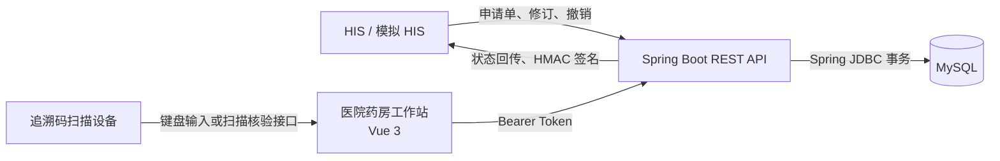
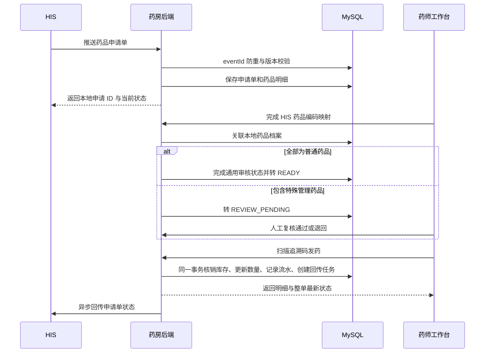
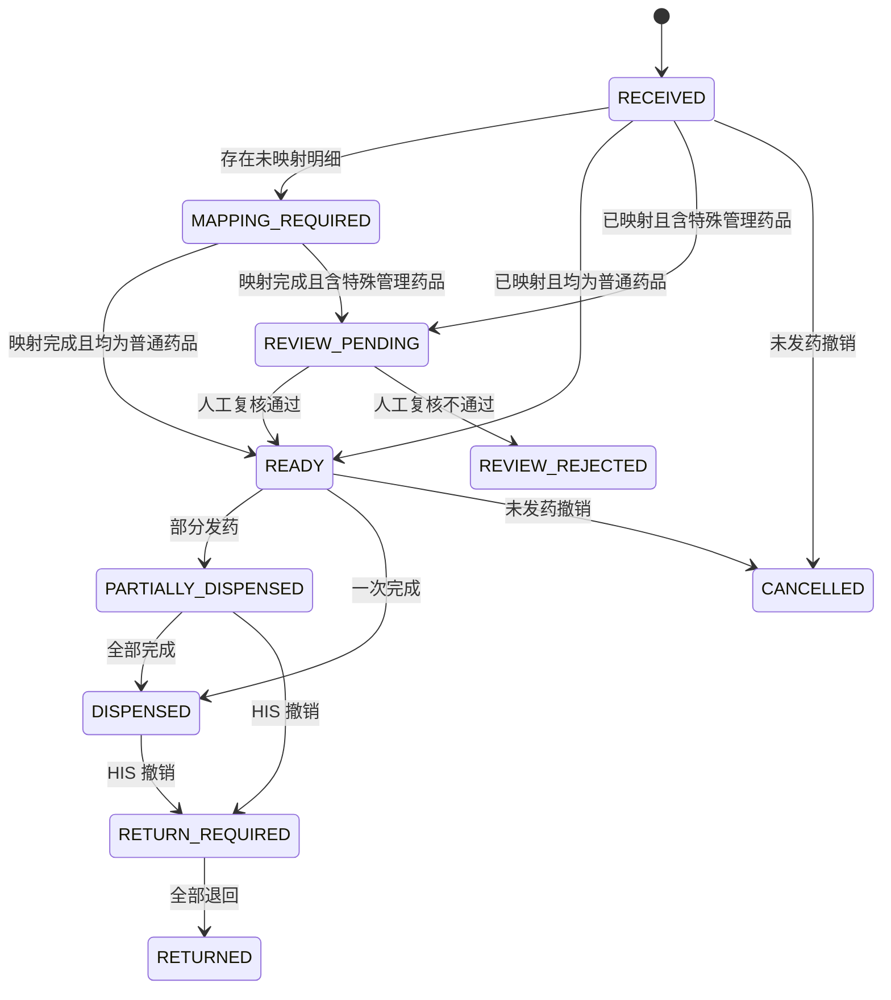

# 系统架构

## 1. 系统定位

Hospital-Drug 是医院药品闭环管理学习系统，围绕门诊药房场景模拟以下协作链路：

`HIS 开立申请 -> 药房接收与药品映射 -> 特殊药品复核 -> 扫码发药/退药 -> 状态回传 HIS`

系统还包含药品档案、库存入库、拆零、盘点、预警、审计、报表和账号权限等配套模块。项目用于熟悉医院业务和接口协作，不是生产医疗系统。

## 2. 系统上下文

系统由浏览器工作台、后端业务服务和 MySQL 数据库三部分组成。HIS 既可以使用本地 `mock` 模式，也可以通过 `rest` 模式连接真实 REST 接口。

## 3. 分层结构

### 3.1 前端层

前端采用 Vue 3 与 Vite，不引入路由或全局状态管理库。

- `App.vue`：认证状态、当前模块和全局对话框入口。
- `AppShell.vue`：侧栏、顶部状态栏、角色导航和业务页面装载。
- `views/`：运营总览、药库质控、药品档案、库存盘点、审计报表和用户管理。
- `HisApplicationWorkbench.vue`：HIS 申请单队列、特殊药品复核、映射、发药与退药。
- `HisIntegrationConsole.vue`：模拟 HIS 申请、回传时间线和失败补发。
- `api/client.js`：后端地址、Bearer Token、会话失效和错误处理。

管理员模块采用异步组件加载；总览图表在进入总览页面后才加载。

### 3.2 接口与安全层

Spring MVC Controller 提供三类接口：

1. 用户接口：使用登录后签发的 Bearer Token。
2. HIS 入站接口：使用 `X-HIS-Key`，真实模式叠加时间戳、随机数和 HMAC-SHA256 签名。
3. 公开健康检查：仅用于确认服务和数据库连接状态。

Spring Security 根据 `ADMIN`、`PHARMACIST`、`NURSE` 三种角色限制访问范围。令牌撤销、登录失败限制、HIS 防重放和统一业务错误由安全及异常模块处理。

### 3.3 业务服务层

服务层负责事务和业务规则，主要边界如下：

- `HisApplicationService`：申请单接收、版本控制、撤销、映射和状态汇总。
- `ApplicationDispenseService`：申请明细发药、原路退药、库存核销和回传任务创建。
- `HisCallbackService`：HIS 状态事件入队、定时发送、失败重试和人工补发。
- `DrugCatalogService`：药品主数据、特殊管理属性和未发药申请重新计算。
- `DrugAcceptanceService`：追溯码入库验收、有效期及重复码校验。
- `DrugSplitService`：整包装拆零与子追溯码管理。
- `InventoryCheckService`：盘点任务、扫描差异和完成状态。
- `AuthService`、`SysUserService`：登录、账号、角色和密码维护。

### 3.4 数据访问层

DAO 使用 Spring JDBC 直接执行参数化 SQL：

- `HisIntegrationDao`：申请单、明细、HIS 映射、入站事件与回传任务。
- `DrugDao`：库存、处方兼容接口、发药流水和拆零库存。
- `DrugCatalogDao`：药品基础档案。
- `InventoryCheckDao`：盘点主表和扫描明细。
- `SysUserDao`、`AuditLogDao`：账号与审计记录。
- `IdempotentRequestDao`：业务请求幂等结果。

实体对象负责数据库行与 JSON 响应映射；HIS 入站请求使用独立 DTO，避免直接把数据库实体作为外部接口契约。

## 4. 核心业务闭环

### 4.1 药品映射

HIS 药品编码通过 `his_drug_mapping` 映射到本地 `drug_catalog`，不依赖药品名称字符串匹配。未映射明细进入 `UNMAPPED`，整单进入 `MAPPING_REQUIRED`。

### 4.2 特殊管理属性

药品档案支持以下属性：

| 值 | 含义 | 特殊人工复核 |
| --- | --- | --- |
| `GENERAL` | 普通药品 | 否 |
| `NARCOTIC` | 麻醉药品 | 是 |
| `PSYCHOTROPIC_I` | 第一类精神药品 | 是 |
| `PSYCHOTROPIC_II` | 第二类精神药品 | 是 |
| `MEDICAL_TOXIC` | 医疗用毒性药品 | 是 |

普通药品在界面中不显示特殊标签。只要申请单包含任一特殊管理药品，整单必须完成人工复核后才能发药。修改药品属性时，系统只重新计算尚未发药的申请，避免影响既有账物记录。

### 4.3 发药一致性

申请明细发药在一个数据库事务内完成：

1. 校验申请状态、复核状态、药品映射和剩余数量。
2. 校验追溯码、药品档案、发药单位和有效期。
3. 原子扣减整包装或拆零库存。
4. 更新申请明细实发数量及整单状态。
5. 写入发药流水和审计日志。
6. 创建 HIS 状态回传任务。

任一步骤失败时事务整体回滚。

### 4.4 退药与撤销

- HIS 在未发药时撤销：申请单直接进入 `CANCELLED`。
- 已部分或全部发药时撤销：申请单进入 `RETURN_REQUIRED`，禁止继续发药。
- 退药必须扫描原追溯码，并验证原发药流水、申请明细和患者归属。
- 已发药数量全部退回后，申请单进入 `RETURNED`。

### 4.5 状态回传

发药、退药、撤销、映射和特殊药品复核都会创建回传事件。`mock` 模式将结果保存在本地联调中心；`rest` 模式向配置地址发送签名 JSON。

失败事件按约 5 秒、30 秒、2 分钟、10 分钟重试，累计 5 次失败后转为人工补发状态。发送进程异常中断的任务可以自动恢复为待发送。

## 5. 状态模型

## 6. 数据模型

| 数据域 | 核心表 | 作用 |
| --- | --- | --- |
| 药品主数据 | `drug_catalog`、`his_drug_mapping` | 本地档案、包装换算、特殊属性及 HIS 编码映射 |
| HIS 申请 | `drug_application`、`drug_application_item` | 申请单主表、明细数量和状态 |
| 库存追溯 | `drug_stock`、`drug_split_code`、`dispense_record` | 单品追溯码、拆零子码及出入库流水 |
| 接口可靠性 | `his_inbound_event`、`his_callback_event`、`his_request_nonce` | 入站幂等、异步回传、防重放 |
| 业务可靠性 | `idempotent_request`、`drug_code_sequence` | 前端重复提交保护和药品编码序列 |
| 运营治理 | `inventory_check`、`inventory_check_item`、`audit_log` | 盘点、差异、审计和报表 |
| 用户安全 | `sys_user`、`revoked_token`、`auth_login_guard` | 账号、令牌撤销和登录失败限制 |

## 7. 运行与部署

本地开发默认拓扑：

- 前端：`http://127.0.0.1:5173`
- 后端：`http://127.0.0.1:8081`
- 数据库：`jdbc:mysql://localhost:3306/hospital_drug_system`

生产化时至少需要独立配置数据库凭据、Token 签名密钥、HIS 接口密钥、HTTPS 回传地址、CORS 来源、备份与灾备策略，并按医院制度完成安全与业务验收。

## 8. 延伸文档

- [文件与模块说明](PROJECT_STRUCTURE.md)
- [REST 接口说明](API.md)
- [数据库升级顺序](../backend/sql/README.md)
